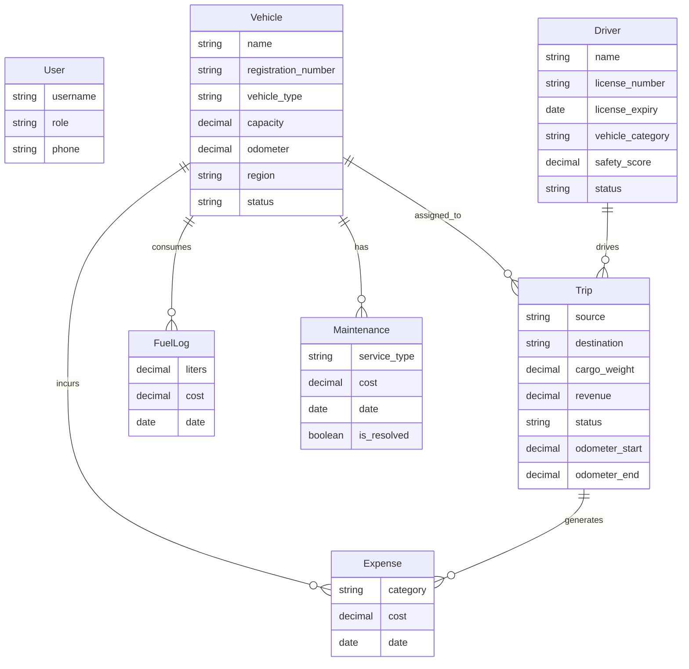

# TransitOps — Smart Transport Operations Platform

TransitOps is a comprehensive Smart Transport Operations Platform designed for mid-to-large transport companies. Built with Django and HTMX, it offers a real-time, single-page application experience for dispatching trips, managing vehicle lifecycles, ensuring driver compliance, and analyzing financial performance.

## 🚀 Key Features

### 🚐 Fleet Registry & Maintenance
- Track vehicle details (Trucks, Vans, Bikes), capacity, region, and acquisition cost
- Real-time status tracking (`Available`, `On Trip`, `In Shop`, `Retired`)
- **Maintenance Logging**: Record service events (Oil Change, Brake Service, etc.) and associated costs. Vehicles automatically transition to `In Shop` until all maintenance is resolved.
- Smart validations (e.g., cannot dispatch a retired or in-shop vehicle)

### 🧑‍✈️ Driver Safety & Compliance
- Track driver assignments, license numbers, and safety scores (0-100)
- **License Expiry Warnings**: Visual alerts for expired or soon-to-expire licenses (within 30 days)
- Category matching: Ensure drivers are only assigned to vehicles they are licensed to operate (e.g., Truck, Van, Bike)
- Track trip completion rates and operational status

### 📦 Trip Dispatch Engine
- Create trips linking a vehicle, driver, source, destination, and expected revenue
- **State Machine Lifecycle**: `Draft` → `Dispatched` → `Completed` (or `Cancelled`)
- **Automated Validation**: Dispatching a trip automatically marks the vehicle and driver as `On Trip`. Completing the trip frees them up and logs the final odometer reading.
- Odometer tracking: Validates that the end odometer reading is greater than the start reading.

### 💰 Finance & Expense Logging
- **Fuel Logs**: Track liters consumed and fuel cost per vehicle
- **Expense Logs**: Log tolls, parking, and other trip-specific or general vehicle costs
- Revenue vs Cost tracking linked directly to trips and vehicles

### 📊 Operational Analytics
- **Command Center Dashboard**: High-level KPIs (active vehicles, pending trips, revenue)
- Multi-dimensional filtering by vehicle type and region
- Detailed Vehicle ROI Table: Track total distance, fuel cost, maintenance cost, efficiency (km/L), total revenue, and Net Profit per vehicle
- Color-coded efficiency metrics and ROI indicators

### 🔐 Strict Role-Based Access Control (RBAC)
TransitOps features a rigid, siloed RBAC system tailored for enterprise logistics workflows. Both server-side access (via decorators) and UI action buttons are restricted based on this matrix:

| Role | Fleet / Maint. | Drivers | Trips | Fuel / Exp. | Analytics |
|---|---|---|---|---|---|
| **Fleet Manager** | Full Manage | Full Manage | View Only | View Only | Full Manage |
| **Dispatcher** | View Only | View Only | Full Manage | — | — |
| **Safety Officer**| — | Full Manage | View Only | — | — |
| **Financial Analyst**| View Only | — | — | Full Manage | Full Manage |

- Server-side enforcement via strict `@role_required` decorators
- HTMX redirect handling cleanly returns unauthorized users to the dashboard
- UI-level enforcement: Action buttons dynamically hide based on the user's role

---

## 🏗️ Architecture & Data Model

### Tech Stack
| Layer | Technology |
|---|---|
| **Backend** | Django 5.1, Python 3.12 |
| **Database** | PostgreSQL / SQLite (Default) |
| **Frontend** | HTMX 1.19, Tailwind CSS (CDN), Native HTML5 `<dialog>` modals |

### Project Structure
```text
transitops/
├── accounts/          # Custom User model, auth views
├── core/              # Dashboard, Settings, RBAC decorators, Management Commands
├── fleet/             # Vehicle & Maintenance models, views, forms
├── drivers/           # Driver model, compliance tracking, status management
├── operations/        # Trip model, dispatch/complete/cancel state machine
├── finance/           # Expense model, fuel tracking, cost analysis
├── analytics/         # Analytics dashboard, data visualizations
├── templates/         # Django templates (base, partials, modals)
│   ├── base.html      # Global layout, sidebar, modal system, toast JS
│   └── ...            # App-specific templates
├── static/            # Static assets
└── manage.py          # Django management script
```

### ER Diagram


---

## 🚀 Getting Started

### Prerequisites
- Python 3.10+
- pip

### Local Setup

```bash
# Clone the repository
git clone https://github.com/ayushkaneriya05/TransitOps.git
cd TransitOps

# Create and activate virtual environment
python -m venv .venv
# Windows
.venv\Scripts\activate
# macOS/Linux
source .venv/bin/activate

# Install dependencies
pip install -r requirements.txt

# Run migrations
python manage.py migrate

# Seed Demo Data (Optional but Recommended)
# This will populate Vehicles, Drivers, Trips, Expenses, and Maintenance logs
python manage.py seed_demo_data

# Create a superuser (to act as the admin)
python manage.py createsuperuser

# Start the development server
python manage.py runserver
```

The app will be available at **http://localhost:8000**

---

## 📖 Usage Guide

### Creating Your First Fleet
1. **Log in** as an Admin or Fleet Manager.
2. **Add Vehicles**: Go to *Vehicle Registry* -> Add Vehicle (name, plate, type, capacity, region).
3. **Add Drivers**: Go to *Drivers* -> Add Driver (name, license, category, expiry).
4. **Create a Trip**: Switch to a *Dispatcher* account (or use Admin). Go to *Trips* -> Create Trip (select vehicle, driver, route, cargo).
5. **Dispatch**: Click the *Dispatch* button on a Draft trip. (Validates availability, license category, and capacity).
6. **Complete**: Click *Complete*, enter the final odometer reading.
7. **Log Expenses**: Switch to a *Financial Analyst* account. Go to *Fuel & Expenses* to log costs.
8. **View Analytics**: Access the *Analytics* module to review operational KPIs, fleet utilization, and per-vehicle ROI.

### HTMX Interactions
TransitOps leverages HTMX for a seamless SPA-like feel:
- **Modal Forms**: All create/edit operations open in a native `<dialog>` modal loaded via HTMX (`hx-get`, `hx-target`).
- **Inline State Changes**: Dispatch, cancel, and status updates swap the table row in-place (`hx-swap="outerHTML"`).
- **Toast Notifications**: Success/error messages appear via `HX-Trigger` headers returning from form submissions.
- **Client-Side Tabs**: Multi-section pages like Settings and Finance use pure vanilla JS tab navigation for instant switching.

---

<p align="center">
  Built with ❤️ for Modern Logistics
</p>
